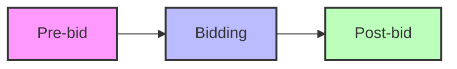
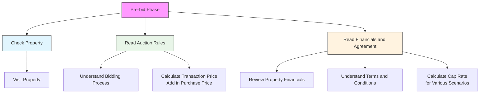

# LoopNet Auction Process

The auction process consists of three main phases:

#### High level

### AI Journal

#### High level
Try 1:
add mermaid block diagram with loopnet tenx auction with following blocks
- prebid
- bidding
- postbid

For bidding block, add following information to the diagram:
Tenx Agent tells the seller agent about the bidders and their maximum potential purchase power.

#### Pre-bid Phase

- check property
  - in-person visit
  - Google maps street view
  - review property details on LoopNet for accuracy
- Read the auction rules
  - understand the bidding process
  - calculate the transation price (add in purchase price)
- Read the financials and agreement
  - review property financials
  - understand terms and conditions
  - calculate cap rate for various scenarios
- Setup process, finances, registration ready

#### Bidding Phase

- Bidding starts at a set time
- Bidding price does not pick up until last day of bid
- Most of the bidding action happens on last day
- 
- Bid increment steps are
  - 250,000
  - 100,000
  - 50,000
  - 25,000
  - 10,000
  - 5,000
- If bid increment decreases, 
  - it means the auction is nearing its end
  - reserve price is close to the auction price
  - last few (typically 2-3 bidders) are very active and try to optimize price
- Bid can be placed manually by adding 1 more dollar to tenx recommended bid (This will throw other bidders off in last minute grab)
- Bid is typically extended 3 minute chucks
- Funds approval (https://www.loopnet.com/cre-explained/auctions/proof-of-funds/):
  - stripe
  - upload online in buyer dashboard
  - email: funding@tenx.com

#### Post-bid Phase

- Winning bidder is notified
- Ernest money deposit is collected
- Closing process begins (30 days)
- 