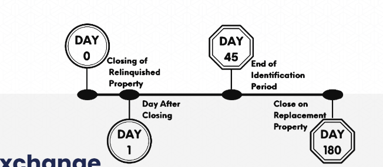

## Summary

## Details

A 1031 exchange, also known as a "like-kind exchange," is a strategy allowed by the IRS under Section 1031 of the Internal Revenue Code. This strategy allows investors to defer paying capital gains taxes on the sale of an investment property if they reinvest the proceeds into a new, similar property within specific time limits and according to certain rules. 

### How it works:

Instead of selling an investment property and paying capital gains tax on the profit, a 1031 exchange allows you to swap one qualifying investment property for another, deferring the tax liability.
The property being sold (relinquished property) and the property being acquired (replacement property) must be "like-kind," meaning they are of the same nature, character, or class. This typically refers to real property held for investment or productive use in a trade or business.
The investor must reinvest the proceeds from the sale into the replacement property.
To successfully defer all capital gains, the replacement property's value must be equal to or greater than the relinquished property's value.
A qualified intermediary (QI) is often involved to hold the proceeds from the sale of the relinquished property, ensuring the investor doesn't directly receive the funds. This is crucial to avoid recognizing taxable income. 

### Key Rules and Requirements:

Like-Kind Property: Both properties must be held for investment or productive use in a trade or business. Personal residences and second homes generally do not qualify.
Identification Period: The investor must identify a replacement property within 45 days of closing on the sale of the relinquished property.
Exchange Period: The replacement property must be acquired within 180 days of closing on the relinquished property's sale.
Equal or Greater Value: The replacement property must be of equal or greater value than the relinquished property to defer all capital gains. If the replacement property is of lesser value, the difference ("boot") is taxable.
Taxpayer's Name: The title to both properties must be in the same taxpayer's name.
Qualified Intermediary: Proceeds from the sale of the relinquished property must be held by a QI. 
Benefits:
Tax Deferral: The main benefit is the ability to postpone paying capital gains taxes on the sale of an investment property. This allows investors to use the entire sale proceeds to reinvest and potentially scale their real estate portfolio.
Asset Repositioning: A 1031 exchange enables investors to strategically shift their investments into different types of properties or locations.
Wealth Building: By deferring taxes and reinvesting, investors can potentially accelerate wealth accumulation.
Estate Planning Benefits: Under proper estate planning, deferred capital gains taxes can potentially be eliminated upon the investor's death when the properties are passed to heirs. 
Important Notes:
The deferred taxes are not eliminated, but rather postponed until the replacement property is eventually sold without another 1031 exchange.
Missteps in the process, such as incorrectly identifying like-kind property or misclassifying assets, can invalidate the exchange and trigger tax liability.
It's highly recommended to work with real estate agents and qualified intermediaries who specialize in 1031 exchanges to ensure proper compliance with IRS regulations. 
A 1031 exchange, also known as a like-kind exchange or Starker exchange, is a strategy that allows investors to defer paying capital gains taxes when they sell an investment property and reinvest the proceeds into a new, similar property. This process is governed by Section 1031 of the U.S. Internal Revenue Code. 

### How it works:

Instead of directly receiving the proceeds from the sale of an investment property and paying taxes on the profit, a 1031 exchange allows you to swap your investment property for another one of "like-kind". The core idea is that you're continuing your investment in real estate, just in a different property. 
Key Aspects:
Tax Deferral: The primary benefit is the ability to postpone capital gains taxes. This allows investors to use the full amount of their sale proceeds to acquire a potentially larger or more desirable investment property.
Like-Kind Property: The properties involved in the exchange must be "like-kind," meaning they are of the same nature, character, or class. This typically means real estate held for investment or business use. However, the properties don't need to be identical; for example, you can exchange a residential rental property for vacant land.
Qualified Intermediary (QI): In most cases, a QI is required to facilitate the exchange. This independent third party holds the proceeds from the sale of the relinquished property, ensuring the investor doesn't directly receive the funds. The QI helps structure the exchange and ensures compliance with IRS regulations.
Reinvestment of Proceeds: The investor must reinvest the proceeds from the sale of the relinquished property into the replacement property.
Equal or Greater Value: To fully defer taxes, the replacement property must be of equal or greater value than the relinquished property. If the replacement property is of lesser value, any remaining proceeds (known as "boot") may be subject to taxes.
Strict Timelines: There are specific deadlines that must be met:
Identification Period: The investor must identify potential replacement properties within 45 days of closing on the sale of the relinquished property.
Exchange Period: The acquisition of the replacement property must be completed within 180 days of closing on the sale of the relinquished property.
Holding Period: Properties involved in a 1031 exchange must be held for investment or business use. Personal residences and second homes generally do not qualify.
Not Personal Property: While the concept of like-kind exchanges applies to real estate properties, it generally does not apply to personal property (with some specific exceptions for real estate businesses). 
Important Considerations:
1031 exchanges can be complex, and it's essential to understand the rules and regulations to ensure a successful transaction.
Working with a qualified intermediary and professional advisors (such as tax advisors or real estate attorneys) is highly recommended.
The tax deferral is not a permanent avoidance of taxes; eventually, taxes will be due when the replacement property is sold without another exchange.
However, with proper estate planning, the deferred capital gains taxes can be eliminated when the property is passed to heirs. 
In essence, a 1031 exchange is a valuable tool for real estate investors to strategically manage their portfolios, defer taxes, and potentially increase their investment potential.

## References

https://lamar1031.com/employees/

https://www.irs.gov/pub/irs-pdf/p544.pdf
