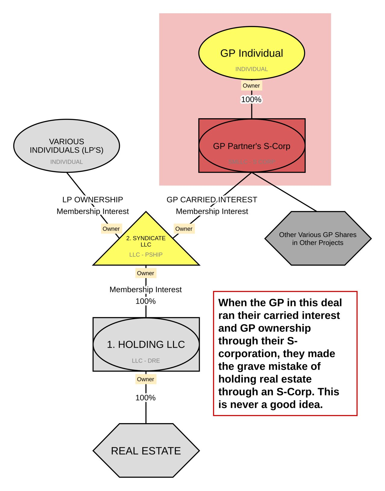

https://www.linkedin.com/posts/dylanbrowncpa_a-simple-guide-to-real-estate-syndication-activity-7110234719606210560-K-dB?utm_source=share&utm_medium=member_desktop

👇A Simple Guide to Real Estate Syndication:
👇The 4 Essential LLC's You NEED to Know About

New to real estate syndication and feeling overwhelmed by the complex structures your attorney is throwing at you? You're not alone.

Most new syndicators find themselves lost at this initial stage. But here's the good news: most real estate syndications follow a basic framework that 90-95% of all syndications use.

In this post, we'll explore the four essential entities every serious syndicator should consider for a straightforward and tax-efficient structure.

1️⃣ Holding LLC

🔷The Holding LLC is the entity that actually takes title to the property. No frills, no complexity—this LLC has just one owner, the Syndicate LLC. Because it has only one owner, it typically won't require a separate partnership tax return, except in a few specific states. All its activities are reported on the Syndicate LLC’s tax return.

2️⃣ Syndicate LLC

🔷The Syndicate LLC is the heartbeat of your syndication structure. It's the sole owner of the Holding LLC and is where all investors pool their capital as Limited Partners (LPs), while the managers hold an interest as General Partners (GPs). This entity is where you'll find all the crucial operating agreement language defining the deal's management and economic distribution. It typically has the most complex tax return and issues K-1 forms to both investors and GPs. It's taxed as a partnership for both federal and state income tax purposes.

3️⃣ GP LLC

🔷If you have multiple GPs, a separate GP LLC is a good idea. It allows for all GPs to receive their carried interest through just one K-1 from the Syndicate LLC. It also provides a way to further define the distribution of the total carried interest among various contributors on the GP side. Additionally, non-owner key employees can receive performance-based compensation through this entity using the carried interest it earns from the Syndicate LLC.

4️⃣ Management LLC

🔷For maximum tax efficiency, it's advisable to separate the receipt of carried interest and management fees between two entities. While the GP LLC owns a direct stake in the Syndicate LLC and thus receives the carried interest, the Management LLC is contracted to collect fees. This structure allows the Management LLC to eventually become an S-Corp, reducing its tax burden. Note that the Management LLC should not own any real estate directly or indirectly, as S-Corps should not hold real estate.

🗝As a CPA focusing on real estate syndications, I guide new syndicators through conversations with attorneys, help review Operating Agreements, and provide tax-smart course corrections. Always keeping your long-term vision in mind, for both the GPs and LPs.

## Deja Vu

https://www.linkedin.com/posts/cre-analyst_syndication-flashback-wsj-1986-ugcPost-7114935355371384834-rKxt?utm_source=share&utm_medium=member_desktop

Déjà Vu All Over Again?

This 37-year-old WSJ article reads like it was published yesterday...

-- A large syndicator (Craig Hall) "struggles to shore up real estate empire"

  -- "His strategy was to borrow as much as possible for as long as possible"

  -- Purchase prices "predicated on some very aggressive assumptions that weren't ever likely to pan out."

-- Could be the beginning of "a chain of big defaults by real estate syndicators and developers, with dire ramifications for the thrift and financial industries"

Sounds familiar, right?

However, the article isn't completely rinse and repeat. A few key differences...

-- Bank flips: In the early/mid-1980s, banks and thrifts would sometimes buy a property and immediately sell it to the bank's borrower, generating fees and artificially elevating the bank's profit.

Example: This article cites a deal that was originally purchased by an S&L for $58.4M, then immediately sold to the syndicator for $64M, generating a big gain for the bank and $3.4M in commissions for the syndicator.

Banks and thrifts are much more regulated now and don't generally engage in ownership, much less flips as outlined above.

-- Tax benefits: In the early 1980s, owners could generate accelerated losses by writing off buildings over relatively short periods of time. In the bank flip example cited above, the syndicator sold $180K units to investors that were expected to generate $200K tax losses over its anticipated seven-year hold period.

The Tax Reform Act of 1986 eliminated these accelerated write-offs and more closely aligned tax gains with actual gains.

----- Systemic failures in the 1980s vs. now -----

More than 20% of the commercial mortgages originated in the mid-1980s defaulted, which sent shock waves through the financial system. More than 2,200 banks failed between 1982 and 1992, and real estate credit markets didn't fully recover until the early 2000s.

It's hard to envision a similar structural collapse now due to:

1. Significantly less leverage in the real estate system.
2. Significantly less reliance on tax-motivated investments.
3. Significantly more regulation and oversight.

So this WSJ article probably doesn't apply to broad levels of risk in the overall real estate markets.

----- Concentrated risk in multifamily -----

However, the behemoth apartment market seems to share many of the risks that syndicators and S&Ls struggled with in the 1980s and 1990s.

More than $800 billion of apartments have been purchased since 2020, often by syndicators. Common threads: Very low cap rates (3.5%), high LTVs (70%+), low debt yields (<6%), low DSCRs (<1.2x), floating rate debt, and short-term maturities.

----- What do you think? -----

What share of the $800 billion of recent apartment trades will need to be restructured with lenders?

A. 50%+
B. 25-50%
C. 10-25%
D. Less than 10%

### S_corp or not

Want to make a massive mistake?
Make Your S-Corp the GP on You Next Deal...

🚫 Top Reasons NOT to Put Your Real Estate GP Interest into an S-Corp 🚫

So you've heard that S-Corps can offer tax benefits and are thinking of using one for your real estate investments? 

Stop right there! 

While S-Corps may be ideal for certain types of businesses, they're generally a bad idea for real estate for several crucial reasons.

🔷 1. GP Depreciation Loss Limitations

With an S-Corp, you'll likely miss out on one of the most attractive benefits in real estate: depreciation losses. S-Corps have stringent basis rules that often suspend losses—something you wouldn't face in a partnership or Single Member LLC (SMLLC).

🔷 2. Cash-Out Refinance Taxes

Planning to do a cash-out refinance that sends money back to the GP? With an S-Corp, you're probably looking at a taxable distribution due to the restrictive basis rules. Unlike partnerships that allow for mortgage-debt-basis (resulting in a tax-free distribution), S-Corps limit your basis to take losses and distributions.

🔷 3. Asset Mobility Issues

Think you can freely move GP assets in and out of your S-Corp? Think again. Unlike partnerships or SMLLCs, taking property out of an S-Corp requires you to recognize gain on any appreciation (or depreciation recapture).

🔷 5. Self-Employment Tax Myth

One common reason people choose S-Corps is to avoid self-employment tax. Guess what? Real estate income isn't subject to self-employment tax, regardless of the entity you choose.

These are just four reasons, but there are plenty more. Got any you can add to the list?

🗝Need guidance on structuring your real estate investments? Don't hesitate to reach out for tailored advice.

🔄 Feel free to repost if you find this information valuable!