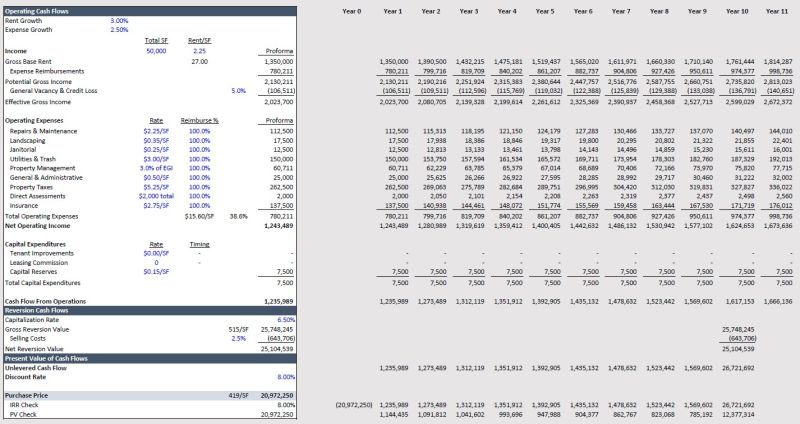

𝗗𝗲𝘁𝗲𝗿𝗺𝗶𝗻𝗶𝗻𝗴 𝘁𝗵𝗲 𝗣𝘂𝗿𝗰𝗵𝗮𝘀𝗲 𝗣𝗿𝗶𝗰𝗲 – 𝗗𝗖𝗙 𝗩𝗮𝗹𝘂𝗮𝘁𝗶𝗼𝗻

How do we determine the right purchase price for a commercial property with a targeted return in mind? By using the 𝗗𝗶𝘀𝗰𝗼𝘂𝗻𝘁𝗲𝗱 𝗖𝗮𝘀𝗵 𝗙𝗹𝗼𝘄 (𝗗𝗖𝗙) 𝗔𝗻𝗮𝗹𝘆𝘀𝗶𝘀. When using this method, the DCF model should be built out to the desired investment timeline, then we can calculate the maximum price we should pay for the property using the cash flow from operations plus the reversion value.

𝘌𝘹𝘢𝘮𝘱𝘭𝘦: We want to purchase a 50,000 square foot industrial building. The property is listed without a price, but the offering memorandum provides income information. The building is currently leased at $2.25/SF triple net, with the tenant reimbursing for all operating expenses. The annual increases are set a 3.0%. 

We built out a 10-year model and estimated what the property would sell for at the end of the hold period. Now we have our unlevered cash flow which is just the cash flow from operations and the net reversion value. 

If we know that we want at least an 8.00% return (discount rate) from this investment. We can use the NPV formula in excel to calculate the appropriate purchase price. The formula is NPV(8.00%,YR 1 Unlevered CF:YR 10 Unlevered CF) = $20,972,250. This is the maximum amount we can pay for the property and hit the 8.00% targeted return.

We can check this with the IRR function in excel by including the -$20,972,250 as the initial cash outflow, followed by the cash inflows from property operations and the sale. We can also check the math with the present value formula PV = CFt/(1+r)^t. The sum of these discounted cash flows equates to the purchase price.

Understanding this method will help ensure you don’t overpay for an asset, while staying aligned with your investment goals. 

If you like this type of content, please drop a like, follow, or comment! I post about CRE finance, valuation, and financial modeling weekly.

