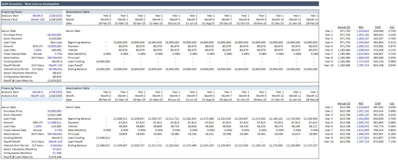

𝗗𝗲𝗯𝘁 𝗔𝘀𝘀𝘂𝗺𝗽𝘁𝗶𝗼𝗻 𝗶𝗻 𝗖𝗥𝗘 – 𝗧𝗮𝗸𝗶𝗻𝗴 𝗢𝘃𝗲𝗿 𝗮𝗻 𝗘𝘅𝗶𝘀𝘁𝗶𝗻𝗴 𝗟𝗼𝗮𝗻
 
𝗗𝗲𝗯𝘁 𝗮𝘀𝘀𝘂𝗺𝗽𝘁𝗶𝗼𝗻 is when a buyer takes over the seller’s existing financing, keeping the original terms (rate, amortization, maturity date).

This can be particularly valuable when the seller’s loan has an interest rate that is lower than what’s currently available; however, there are other things to consider than just the lower rate. 

Lender approval will be required to make sure the new buyer meets financial qualifications. Also, if the property has appreciated over the past few years, it’s likely selling for a higher price to the new buyer and if the outstanding loan balance is being assumed this means they are going in with a lower loan-to-value (LTV). In other words, the new buyer will need a higher down payment. Additionally, if the loan is past its interest-only period, this could affect the new owner’s cash flow.

𝘌𝘹𝘢𝘮𝘱𝘭𝘦: We are acquiring a 70-unit apartment complex for $26,000,000. The terms for a new loan are $16,900,000 (65% LTV), 5.75% fixed rate, 30-year amortization, with a 5-year initial interest-only period.

The previous owner originally bought the property with a loan of $13,000,000, 4.75% fixed rate, 30-year amortization, with a 3-year initial interest-only period. After holding for six years, they are now selling so some principal has been paid down. We also have the option of assuming this debt with the same terms at an outstanding loan balance of $12,368,512 (48% LTV) and a monthly amortizing payment of $67,814, or $813,768 annually. 

For a quick comparison, we modeled out the debt scenarios and entered the net operating income from the 10-year cash flow model in the offering memorandum. We can see that the new loan offers a higher cash-on-cash return up until the interest-only period is over. However, the most significant difference is the amount of equity we would have the come in with. The difference in down payment is $4,531,488 ($9,100,000 vs $13,631,488).

In an environment of high borrowing costs, debt assumption can be a powerful tool. However, no two properties or borrowers are the same – it depends on the situation. Weighing the other factors and the current available debt options carefully is essential to ensuring the financing structure aligns with investor goals.

If you like this type of content, please drop a like, follow, or comment! I post about CRE finance, valuation, and financial modeling weekly.

