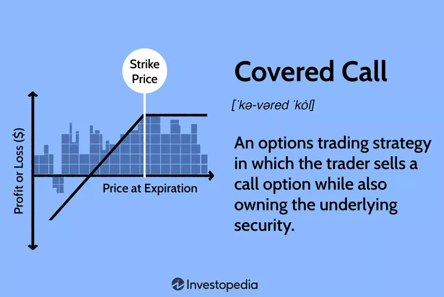
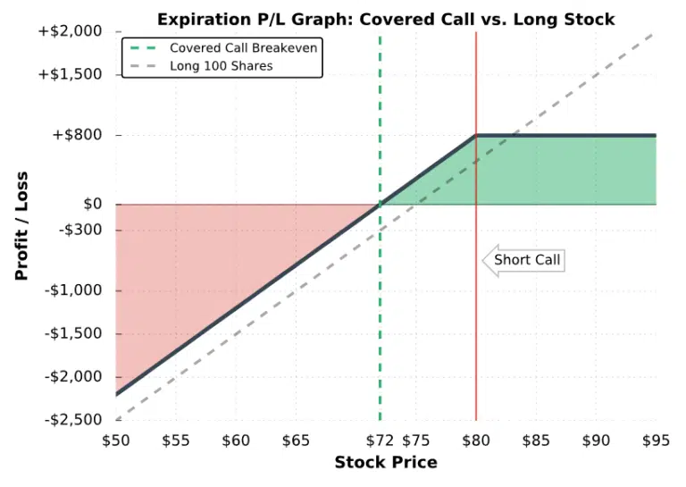

## Summary

### Sharp Rise in Stock Price or Expect the Stock to go down

If a stock rises sharply and is expected to go down from there based on short-term momentum, 
- a covered call can be a good strategy. 
- investor can sell a call option at a strike price above the current stock price, capturing some of the upside while still holding the stock. 
- If the stock does not rise above the strike price, the investor keeps the premium from selling the call option.

### References

- [Covered Call Strategy](https://www.investopedia.com/terms/c/coveredcall.asp)
https://www.projectfinance.com/buy-write/

https://www.pyquantnews.com/free-python-resources/generate-income-with-covered-calls-puts

